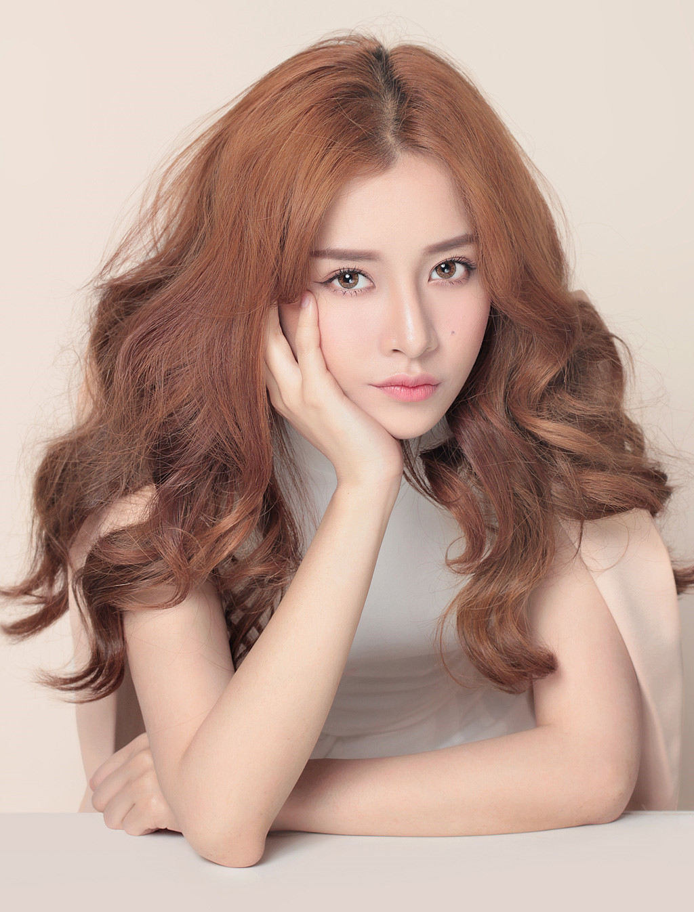
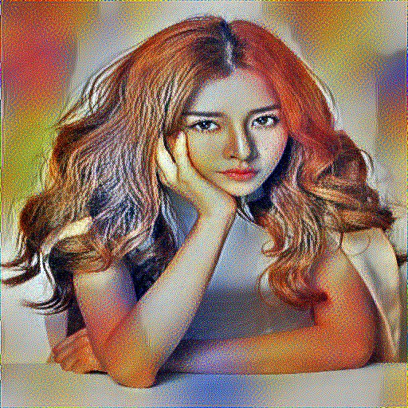
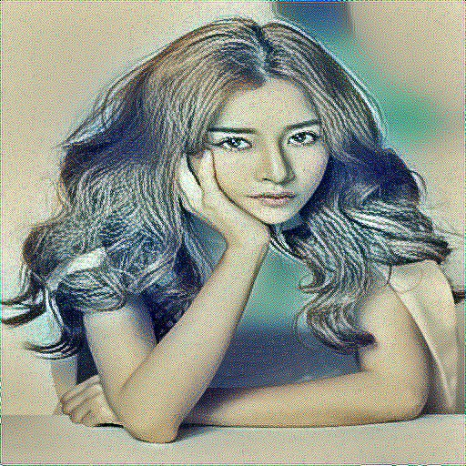
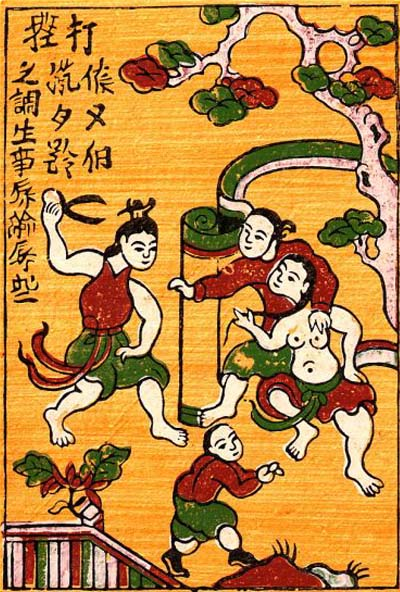
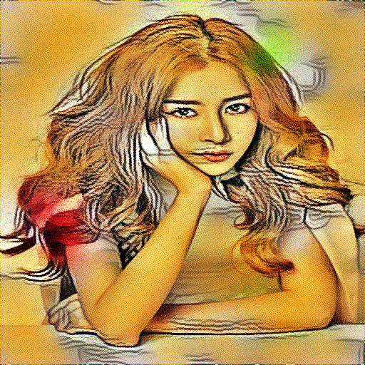

Fast style-transfer
==================

Download VGG16 pretrained model from:

## Todo

* [x] content loss, style loss, total variabtion...
* [x] train op
* [ ] web app
* [ ] image2image net

## Style transfer by optimization

* Extract content features from `conv2_2` of VGG16
* Extract style features from `conv1_2`, `conv2_2`,
                  `conv3_3`, `conv4_3`,
                  `conv5_3`
* Optimize with Adam optimizer
* Results:

### Content

Content | Style | Result
------------ | ------------- | -------------
 |  | 
 |  | 
 |  | 

